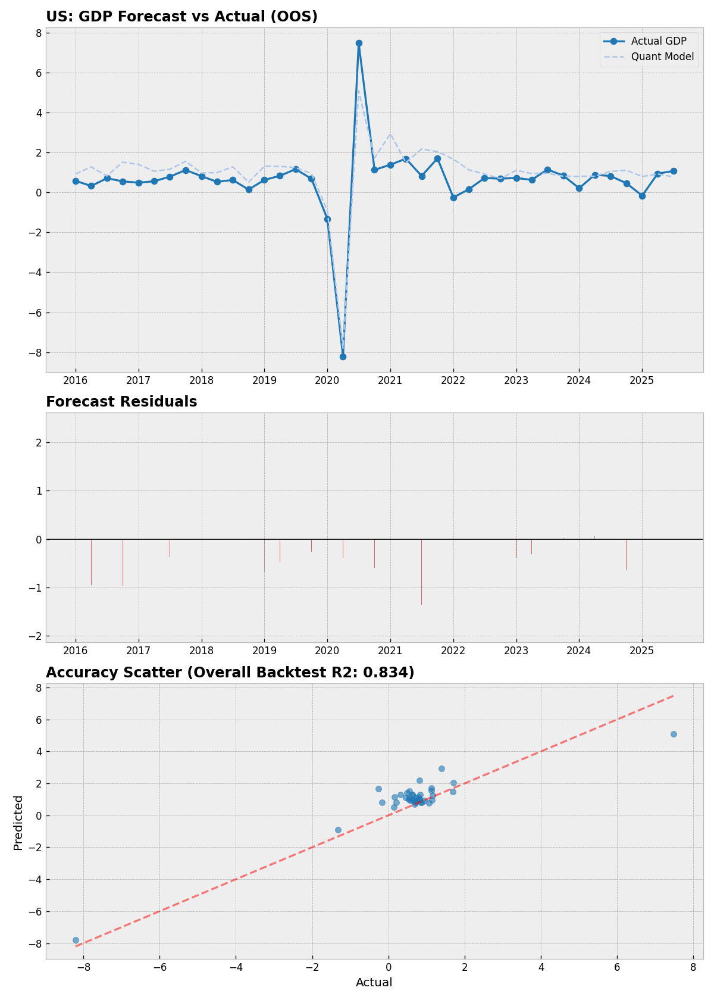
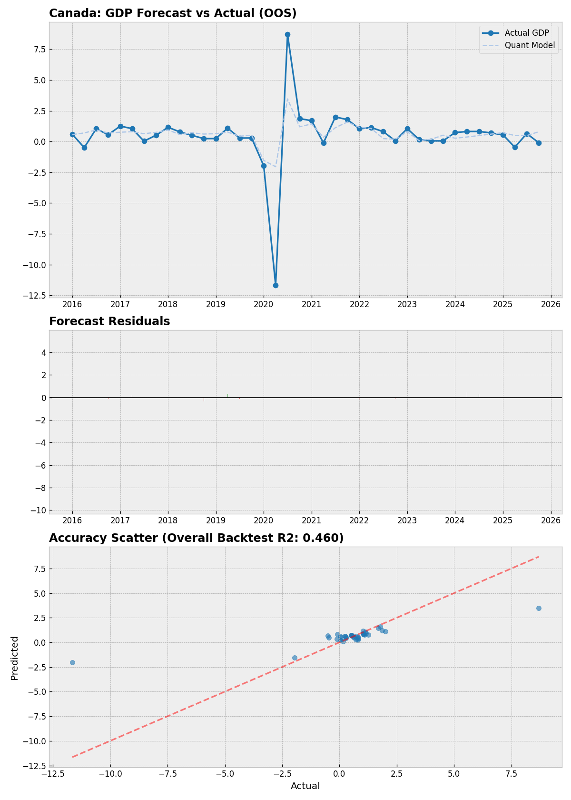

# AI Economist Skill

**Structural AI for Macroeconomic Intelligence: Domain-Constrained Inference & Nowcasting**


---

## 🧠 Philosophy: Beyond the Black Box

Most AI applications in finance fail because they treat LLMs as unconstrained "black box" predictors. This project presents a different approach: **Structural AI Integration.**

Instead of making blind guesses, this AI Agent operates within strictly defined macroeconomic guardrails. The key insight is simple:

> **AI's value is a multiplier of domain knowledge.**  
> Without a solid understanding of models like the Taylor Rule or Dynamic Factor Models, it is difficult to build a serious and interpretable forecasting system using AI alone.

By anchoring LLMs within established economic frameworks, we produce assessments that align with institutional consensus while maintaining the speed and adaptability of an AI Agent.

---

## 📊 Modules

### 1. Model-Implied Policy Rate (Taylor Rule Framework)

A Bayesian Taylor Rule framework that calculates the "neutral" vs "restrictive" stance of the Federal Reserve and Bank of Canada.

**Structural Base:**
- Non-linear Taylor Rule with asymmetric reaction coefficients for high-inflation regimes
- Multiple output gap estimators: Okun's Law, HP Filter, Capacity Utilization

**AI Bayesian Layer:**
- Performs **Counterfactual Inference** by mapping the actual rate against the model's 95% confidence interval
- Calculates Z-scores to identify "Low-Entropy" states vs "Tail-Risk" premiums
- Provides probabilistic interpretation of policy stance

### 2. GDPCastNow (Dynamic Factor Model)

A real-time GDP growth tracking engine combining traditional econometrics with AI enhancement.

**Structural Base:**
- **Bridge Equations** using high-frequency indicators (Industrial Production, Retail Sales, Payrolls)
- **SVD (Singular Value Decomposition)** to extract latent factors from "ragged-edge" data
- AR(1) nowcasting for missing observations

**AI Enhancement Layer:**
- Real-time sentiment alpha correction from newsflow (Fed/BoC communications)
- StatCan official outlook integration for Canada
- Bayesian trend anchor (shrinkage filter) for volatility dampening

---

## 📈 Backtest & Validation

### Model-Implied Policy Rate: Institutional Comparison

The policy rate assessments produced by this framework are broadly consistent with the consensus views of institutional economists. The chart below compares the model output against real forecasts from major financial institutions:


### GDPCastNow: US Market (2016–Present)

| Metric | Value |
|--------|-------|
| **Overall Backtest R²** | 0.8335 |
| **RMSE** | 0.76% |
| **MAE** | 0.56% |
| **AI Alpha vs Quant Baseline** | +4.20% improvement |



### GDPCastNow: Canada Market (2016–Present)

| Metric | Value |
|--------|-------|
| **Overall Backtest R²** | 0.4596 |
| **RMSE** | 1.78% |
| **MAE** | 0.70% |
| **AI Alpha vs Quant Baseline** | +2.74% improvement |



---

## 🚀 Quick Start

```bash
# Install dependencies
pip install -r requirements.txt

# Run GDP Nowcast
python main.py gdp --country US
python main.py gdp --country Canada

# Run Policy Rate Analysis
python main.py policy --country US
python main.py policy --country Canada
```

### Example Output: GDP Nowcast (US)
```
🏦 GDPCastNow | Real GDP Forecast (US)

Target Quarter: Current Q Real GDP Growth (Q/Q)

🚀 Core Forecast Data
- Quant Baseline Nowcast: 0.55%
- AI Sentiment Adjustment: +0.00%
- Final Forecast: 0.55%
- Model Confidence (R²): 0.69
```

### Example Output: Policy Rate (US)
```
🏦 Model-Implied Policy Rate: Federal Reserve

Policy Stance: Neutral
Deviation: +14 bps

Macro Overview:
- Core Inflation: 2.80%
- Output Gap: -0.50% (HP Filter)
- Current Policy Rate: 3.64%
- Taylor Rule Implied Rate: 3.50%

Bayesian Inference:
- 95% Confidence Interval: [3.00%, 4.00%]
- Z-Score: ≈ 0.3 (Center of distribution)
```

---

## 🏗️ Architecture

```
AI-Economist-Skill/
├── src/
│   ├── engine/           # High-level task modules
│   │   ├── policy_rate_engine.py
│   │   └── gdp_nowcast_engine.py
│   ├── core/             # Economic modeling
│   │   ├── modeling_core.py
│   │   └── visual_oracle.py
│   └── data_utils/       # Data infrastructure
│       └── macro_data_fetcher.py
├── assets/               # Visualizations
├── main.py               # Unified CLI
├── requirements.txt
└── SKILL.md              # Technical documentation
```

---

## 🔧 Technical Details

### Taylor Rule Implementation

The non-linear Taylor Rule with asymmetric preferences:

```
i = r* + π + 0.5(π - π*) + 1.0(gap)           [Standard 1999]
i = r* + π + 0.5 × k(π - π*) + 1.0(gap)       [Non-linear, k=1.5 if π > 2.5%]
```

### SVD Factor Extraction

For the Dynamic Factor Model:
1. Standardize all indicator series
2. Apply SVD: `X = UΣV'`
3. Extract first principal component: `Factor = U[:,0] × Σ[0]`
4. Bridge to quarterly GDP via OLS

### Data Sources
- **FRED API**: US macro indicators, Canadian cross-listed series
- **BLS**: Real-time unemployment data
- **Bank of Canada**: Policy rate, neutral rate estimates, output gap
- **StatCan**: Official GDP flash estimates

---

## 📄 License

MIT License

---

## 🔗 Related

- [Claude Code Skills Documentation](https://docs.anthropic.com/en/docs/claude-code/skills)
- [Federal Reserve Economic Data (FRED)](https://fred.stlouisfed.org/)
- [Bank of Canada Indicators](https://www.bankofcanada.ca/rates/indicators/)

---

*Built with domain expertise. Enhanced with AI.*
