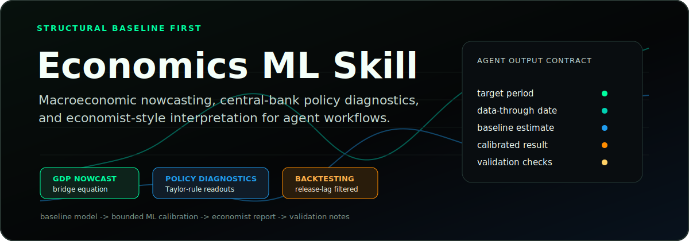
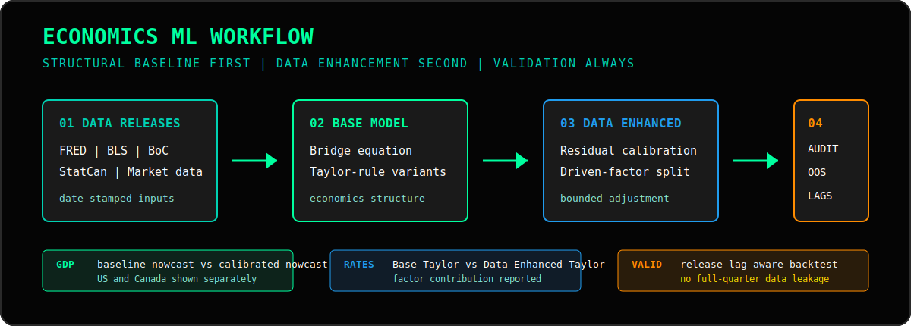

<p align="center">
  
</p>

<p align="center">
An installable agent skill for macroeconomic nowcasting, central-bank policy<br />
diagnostics, and economist-style interpretation. The installable skill lives in
<a href="economics-ml/"><code>economics-ml/</code></a>; the dashboard and tests are project-side<br />
supporting files.
</p>

<div align="center">
  
</div>

<div align="center">

[](https://garroshub.github.io/ai-economist-skill/)
[](https://github.com/garroshub/ai-economist-skill/discussions)
[](LICENSE)

</div>

---

## What It Does

| Layer | Main Output | Role of ML |
| --- | --- | --- |
| GDP nowcast | Bridge-equation baseline by country and quarter | Bounded residual calibration, reported separately |
| Policy diagnostics | Base Taylor and Data-Enhanced Taylor readouts | Historical residual calibration against observable macro factors |
| Backtesting | Baseline vs calibrated OOS comparison | Prior-window calibration only, release-lag filtered |
| Agent report | Driven factors, data-through dates, validation notes | Structured interpretation, not a hidden predictor |

ML is not the primary forecaster. It is an auxiliary calibration and measurement
layer used to explain where the structural model may be missing information.

## Install As An Agent Skill

Install the `economics-ml/` folder for normal use. It contains `SKILL.md`, the
Python runtime, and requirements. The repository-level `dashboard/`, `tests/`,
and `assets/` folders are not part of the installed skill.

macOS/Linux:

```bash
tmpdir="$(mktemp -d)"
git clone --depth 1 https://github.com/garroshub/ai-economist-skill.git "$tmpdir/ai-economist-skill"
rm -rf ~/.codex/skills/economics-ml
cp -R "$tmpdir/ai-economist-skill/economics-ml" ~/.codex/skills/economics-ml
rm -rf "$tmpdir"
cd ~/.codex/skills/economics-ml
pip install -r requirements.txt
```

Windows PowerShell:

```powershell
$skillDir = "$env:USERPROFILE\.codex\skills\economics-ml"
$tmpDir = Join-Path $env:TEMP "ai-economist-skill"
Remove-Item -LiteralPath $tmpDir -Recurse -Force -ErrorAction SilentlyContinue
git clone --depth 1 https://github.com/garroshub/ai-economist-skill.git $tmpDir
Remove-Item -LiteralPath $skillDir -Recurse -Force -ErrorAction SilentlyContinue
Copy-Item -Recurse -LiteralPath "$tmpDir\economics-ml" -Destination $skillDir
Set-Location $skillDir
pip install -r requirements.txt
```

After installation, ask the agent for tasks such as:

```text
Use the Economics ML skill to explain the latest US and Canada GDP nowcast drivers.
Use the Economics ML skill to compare Base Taylor and Data-Enhanced Taylor signals.
Use the Economics ML skill to audit whether the backtest has forward-information leakage.
```

The skill should answer with target period, data-through date, baseline estimate,
data-enhanced estimate, driven factors, validation checks, and limitations. It
should not merely point the user to a Python command.

### Analysis-Only Install

If you only want the agent to produce structured interpretation from
user-provided values or existing reports, `SKILL.md` alone is enough. Live data
pulls and backtests require the runtime bundle above.

### Full Repository Clone

Clone the full repository only for development, dashboard work, or tests:

```bash
git clone https://github.com/garroshub/ai-economist-skill.git
```

In a full clone, `dashboard/`, `tests/`, `src/`, and the Python entrypoints are
project files. Only `economics-ml/` is required for installing the agent skill.

## Current Modules

### GDP Nowcasting

- Structural bridge model with SVD factor extraction.
- Ragged-edge filling for missing recent monthly observations.
- US high-frequency auxiliary variables: initial claims, housing, durable goods,
  real disposable income, financial conditions, and yield curve.
- Canada auxiliary variables: StatCan retail sales, CPI, CAD/USD, WTI oil, and
  US demand spillover measures.
- Baseline and ML-calibrated nowcasts shown side by side.

### Policy Rate Diagnostics

- Taylor 1993, Taylor 1999, and nonlinear inflation-response variants.
- Output-gap proxies from labor slack, HP-filtered GDP, and capacity utilization.
- Base Taylor result remains the main structural signal.
- Data-Enhanced Taylor result learns historical residual adjustments from
  activity, inflation pressure, financial conditions, external pressure, and
  labor cooling.
- Enhancement decomposition is reported in percentage-point contributions.

### Validation

- Expanding-window backtest for GDP nowcasts.
- Release-lag-aware pseudo-real-time feature filtering.
- Baseline R2/RMSE and ML-calibrated R2/RMSE shown on the same validation window.
- Revised-data limitation is disclosed rather than treated as a vintage-data test.

## Optional Runtime Tools

The skill can be used for analysis without running local scripts. Install the
runtime dependencies only when you want live data pulls, regenerated reports,
backtests, or local dashboard builds.

```bash
cd economics-ml
pip install -r requirements.txt
set FRED_API_KEY=your_key_here
```

Run GDP nowcasts:

```bash
python main.py gdp --country US
python main.py gdp --country Canada
```

Run policy diagnostics:

```bash
python main.py policy --country US
python main.py policy --country Canada
```

Run backtests:

```bash
python backtest_engine.py
```

Build the dashboard:

```bash
cd dashboard
npm ci
npm run build
```

## Data Sources

- FRED API for macro indicators.
- BLS and Bank of Canada public data where available.
- Statistics Canada public CSV tables for retail-sales auxiliary features.
- Public news and outlook pages only when converted into structured measurement
  variables.

No private API key is stored in the repository. Set `FRED_API_KEY` locally before
running live workflows.

## Agent Output Contract

Reports should include the forecast target period, data-through date, source
coverage, structural baseline, calibrated result, driven-factor decomposition,
backtest window, leakage controls, and limitations. Causal claims require a
separate identification design.

## Repository Structure

```text
ai-economist-skill/
|-- README.md
|-- economics-ml/
|   |-- SKILL.md
|   |-- main.py
|   |-- backtest_engine.py
|   |-- requirements.txt
|   `-- src/
|-- dashboard/
|-- assets/
`-- tests/
```

For skill installation, use only `economics-ml/`. The dashboard, tests, and
assets support the public project page and validation workflow.

## Star History

<div align="center">

[](https://www.star-history.com/#garroshub/ai-economist-skill&Date)

</div>
